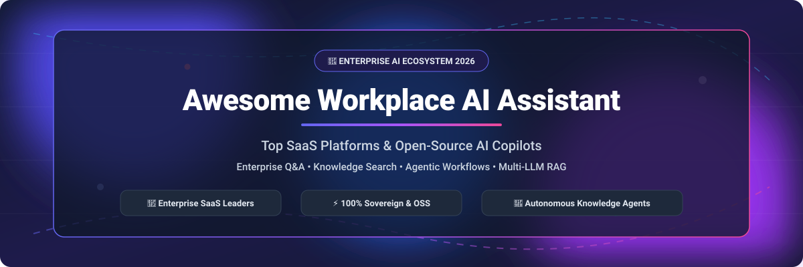

# 🤖 Awesome Workplace AI Assistant

  
  
  
  
  
  

  

## 🚀 Top Workplace AI Assistant Ecosystem

> **Curated List of SaaS Products & Open-Source GitHub Projects**  
> *Focused on Enterprise Knowledge Q&A, AI Copilots, Autonomous Agents & Workflow Automation*  
> **Last updated: October 2026**

This repository tracks notable **SaaS platforms** and **open-source projects** for **Workplace AI Assistants**, **Enterprise RAG Copilots**, and **Autonomous Workstream Agents**. These tools connect to an organization's existing data sources — documents, emails, chat, tickets, code, and enterprise APIs — to provide grounded answers with precise citations, automate multi-step tasks, and surface organizational knowledge.

---

## 📑 Table of Contents
- [📊 Market Overview & SaaS Platforms](#-market-overview--saas-platforms)
- [⚡ Open-Source GitHub Projects](#-open-source-github-projects)
- [🛠️ Frameworks for Building Workplace AI](#-frameworks-for-building-workplace-ai)
- [🤝 How to Contribute](#-how-to-contribute)
- [⚠️ Disclaimer](#%EF%B8%8F-disclaimer)
- [📈 Star History](#-star-history)
- [💖 Support & Community](#-support--community)

---

## 📊 Market Overview & SaaS Platforms

> 💡 **Market Size & Structure**: The global Workplace AI Assistant market is estimated at **$14.8 Billion in 2026** (projected to exceed **$60 Billion by 2030** at a 32% CAGR). The sector is **moderately fragmented**, transitioning from single-application AI helpers to broad enterprise intelligence ecosystems. Suite leaders (Microsoft, Google, Salesforce) leverage existing productivity software dominance, while specialized enterprise search and agent platforms (Glean, Notion, Onyx) capture deep cross-app workflows across fragmented tools.

### 🏢 Enterprise SaaS Platforms (Sorted by Company Size / Valuation)

| SaaS Platform | Description & Key Capabilities | Company Size (Valuation / Revenue) | Specific Pricing (Starting Tier) | Free Tier / Trial Limits |
| :--- | :--- | :--- | :--- | :--- |
| **[Microsoft 365 Copilot](https://www.microsoft.com/microsoft-365/copilot)** | Integrated AI copilot across Word, Excel, PowerPoint, Outlook, Teams, and Business Chat grounded in Microsoft Graph enterprise data. | **$3.1 Trillion** *(Market Cap)* / $245B Rev | **$30.00 / user / month** *(Copilot for M365 annual contract)* | **30-day enterprise trial** or Free Copilot Web (without org data binding) |
| **[Amazon Q Business](https://aws.amazon.com/q/business/)** | AWS-native generative AI assistant with 40+ connectors (Slack, Teams, Jira, S3). Extracts semantic meaning from visual/textual enterprise docs. | **$2.0 Trillion** *(Market Cap)* / $600B Rev | **$3.00 / user / month** *(Lite tier)* / **$20.00 / user / month** *(Pro tier)* | **50-day free trial** for up to 50 user seats |
| **[Google Workspace Gemini](https://workspace.google.com/solutions/ai/)** | AI workspace assistant embedded in Gmail, Docs, Sheets, Slides, and Meet with NotebookLM deep research and 45+ language support. | **$2.0 Trillion** *(Market Cap)* / $307B Rev | **$20.00 / user / month** *(Gemini Business add-on)* / **$30.00 / user / month** *(Enterprise)* | **14-day Workspace free trial** |
| **[Salesforce Agentforce](https://www.salesforce.com/agentforce/)** | Autonomous & copilot enterprise AI natively connected to Salesforce Data Cloud, Customer 360, sales, service, and marketing workflows. | **$300 Billion** *(Market Cap)* / $35B Rev | **$2.00 / conversation** or **$125.00 / user / month** *(Sales/Service Agent)* | **30-day Developer/AI Org free trial** |
| **[Slack AI](https://slack.com/features/ai)** | Native Slack channel/thread summarizer, enterprise search, Slack Code agentic coding, and automated search synthesis. | **$27.7 Billion** *(Acquisition Value by Salesforce)* | **$10.00 / user / month** *(Add-on to Slack Pro tier starting at $7.25/mo)* | **30-day Pro / Business+ plan free trial** |
| **[Atlassian Intelligence](https://www.atlassian.com/software/artificial-intelligence)** | AI assistant natively integrated across Jira, Confluence, and JSM with NL-to-JQL conversion and virtual agent dispatch. | **$45 Billion** *(Market Cap)* / $4.4B Rev | **$15.25 / user / month** *(Included in Jira Cloud Premium tier)* | **30-day Cloud Premium tier free trial** |
| **[Zoom AI Companion](https://www.zoom.com/en/products/ai-assistant/)** | Agentic workplace assistant with meeting summaries, action items, team chat synthesis, and personal automation workflows. | **$20 Billion** *(Market Cap)* / $4.5B Rev | **$13.33 / user / month** *(Included with Zoom Workplace Pro tier)* | **Free Basic Plan** *(40-min meeting limit; AI Companion requires Pro plan)* |
| **[Notion AI](https://www.notion.com/product/ai)** | Workspace knowledge assistant featuring Q&A across external connected tools, AI Meeting Notes, and database content generation. | **$10 Billion** *(Private Valuation)* | **$8.00 / user / month** *(Billed annually)* / **$10.00 / user / month** *(Monthly)* | **20 free AI responses limit** per workspace member |
| **[Glean](https://www.glean.com/)** | Enterprise AI coworker and search engine connecting 100+ company SaaS apps with permission-aware RAG citations. | **$4.6 Billion** *(Private Valuation)* | **$10.00 / user / month** *(Base Enterprise Seat)* | **30-day guided enterprise Proof-of-Concept (PoC)** |
| **[Box AI](https://www.box.com/ai)** | Enterprise document AI agent for metadata extraction, file summarization, and multi-document synthesis inside Box content cloud. | **$4.5 Billion** *(Market Cap)* / $1.0B Rev | **$25.00 / user / month** *(Business Plus tier)* / **$35.00 / user / month** *(Enterprise)* | **14-day Enterprise plan free trial** |

---

## ⚡ Open-Source GitHub Projects

> **Self-Hosted & Sovereign AI**: Open-source workplace AI projects provide air-gapped security, custom connector flexibility, zero data leakage, and total control over LLM routing and vector storage.

### 🌟 Top Open-Source Workplace AI Projects (Sorted by GitHub_Stars)

| Project & Repository | Description & Architectural Highlights | GitHub Stars_Count | License |
| :--- | :--- | :--- | :--- |
| **[Dify](https://github.com/langgenius/dify)** | Leading open-source LLM application development platform and workplace AI workflow orchestrator with agentic RAG, tool ecosystem, and visual workflow canvas. |  | `Apache-2.0` |
| **[Open WebUI](https://github.com/open-webui/open-webui)** | Feature-rich, self-hosted web UI for Ollama, OpenAI, and custom workspace models with RAG integration, web search, webhooks, and granular multi-user permission controls. |  | `MIT` |
| **[RAGFlow](https://github.com/infiniflow/ragflow)** | Open-source deep RAG engine for complex enterprise document understanding, layout analysis, table extraction, and grounded workplace Q&A workflows. |  | `Apache-2.0` |
| **[AnythingLLM](https://github.com/Mintplex-Labs/anything-llm)** | All-in-one desktop & enterprise AI workspace for turning documents, resources, and URLs into context for any LLM with full privacy and zero tracking. |  | `MIT` |
| **[Quivr](https://github.com/QuivrHQ/quivr)** | Open-source enterprise Second Brain / AI assistant for centralizing un-structured unstructured data (PDFs, docs, notes) into searchable vector knowledge graphs. |  | `Apache-2.0` |
| **[Onyx](https://github.com/onyx-dot-app/onyx)** *(formerly Danswer)* | The leading open-source enterprise search and AI assistant platform. Features 40+ connectors (Slack, Drive, Jira, GitHub, Notion, SharePoint) with permission inheritance and air-gapped deployment. |  | `MIT` |
| **[Vexa](https://github.com/shaneholloman/vexa)** | Autonomous meeting notetaker and real-time knowledge assistant for Google Meet, Zoom, Teams, and Jitsi with local Whisper transcription and scheduled routine dispatches. |  | `Apache-2.0` |
| **[Bionic GPT](https://github.com/bionic-gpt/bionic-gpt)** | Sovereign agentic AI harness built in Rust for private cloud and Kubernetes deployments. Includes sandboxed code execution, RAG pipelines, and OIDC enterprise SSO. |  | `Apache-2.0` |
| **[Mewbo](https://github.com/bearlike/Assistant)** | Agentic work stack with parallel sub-agent hypervisors, AST-to-memory-graph Wiki, isolated Git worktree execution, and Landlock sandbox security. |  | `Apache-2.0` |
| **[OpenBeam](https://github.com/kuluruvineeth/openbeam)** | Open-source hybrid semantic + keyword search engine for SaaS and IoT physical systems with sub-200ms p99 latency and autonomous Temporal agent workflows. |  | `MIT` |
| **[Dotstell](https://github.com/dotstell/dotstell)** | Open-source personal and team knowledge graph connecting notes, people, tasks, and bookmarks with local Ollama / cloud LLM multi-turn RAG chat. |  | `AGPL-3.0` |
| **[The Curator](https://github.com/talirezun/the-curator)** | Domain-agnostic knowledge organization engine ingesting markdown into structured entity summaries with Obsidian graph visualization and GitHub sync. |  | `MIT` |

---

## 🛠️ Frameworks for Building Custom Workplace AI

When architecting a custom self-hosted workplace AI solution:
- Combine **[Onyx](https://github.com/onyx-dot-app/onyx)** for comprehensive enterprise document indexing across 40+ SaaS tools.
- Deploy **[Dify](https://github.com/langgenius/dify)** or **[Open WebUI](https://github.com/open-webui/open-webui)** for visual prompt engineering, agentic workflows, and team chat interfaces.
- Leverage **[RAGFlow](https://github.com/infiniflow/ragflow)** for complex unstructured PDF, financial report, and table parsing.
- Use **[Bionic GPT](https://github.com/bionic-gpt/bionic-gpt)** or **[Mewbo](https://github.com/bearlike/Assistant)** for air-gapped Kubernetes deployments requiring strict sandboxed tool execution.

---

## 🤝 How to Contribute

We welcome community contributions! To add a new platform or repository to this list:

1. Fork this repository.
2. Add or update entries in `README.md` maintaining table structure and factual references.
3. Include: Product Name, Direct Link, Description, Pricing/Stars_Badge, and Free Tier details.
4. Open a Pull Request with a short summary of the addition.

---

## ⚠️ Disclaimer

- This repository is a **community-curated index** for informational and research purposes.
- Workplace AI tools process sensitive organizational data and must adhere to enterprise compliance standards (GDPR, SOC2, HIPAA, CCPA).
- Generative AI models can hallucinate or omit context. Human review remains essential for critical business decisions.

---

## 📈 Star History

---

## 💖 Support & Community

Thank you for exploring **Awesome Workplace AI Assistant**! If this repository helped you evaluate, build, or deploy workplace AI tools in your organization, please consider supporting the project:

- ⭐ **Star this repository** on GitHub to help others discover enterprise AI solutions.
- 🔀 **Fork & Contribute** to keep our ecosystem index fresh and accurate.
- 📢 **Share** with your engineering, IT, and AI community.
- ☕ **Sponsor the Maintainer**: Support ongoing development and maintenance via [GitHub Sponsors](https://github.com/sponsors/ishandutta2007).

  

